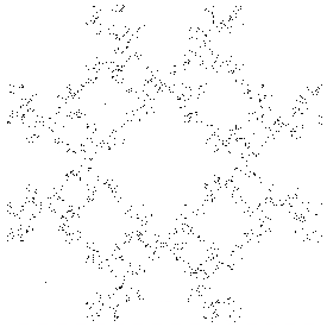
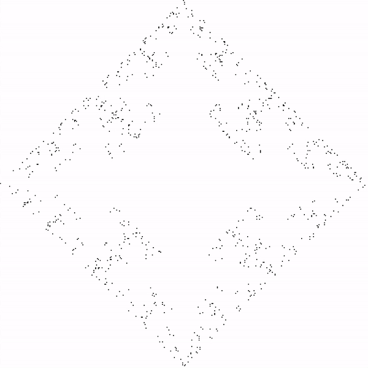
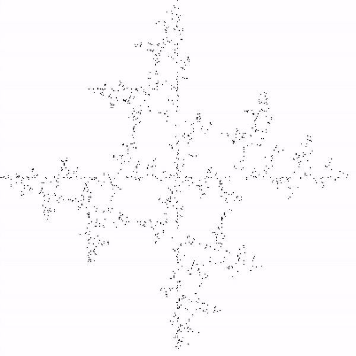
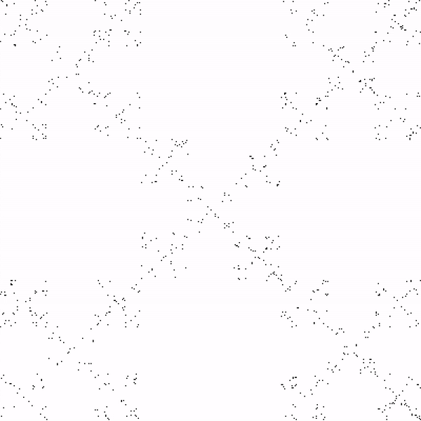
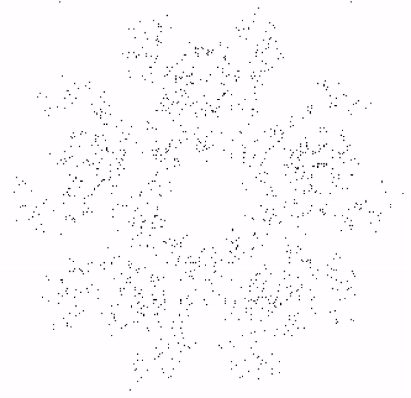
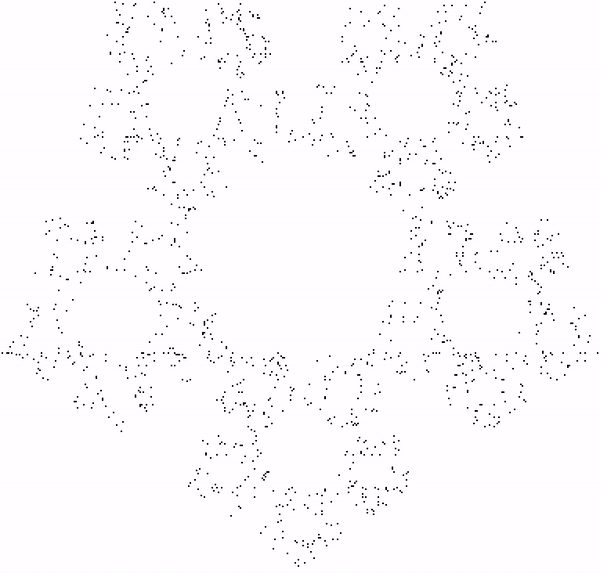

# Fractals with Chaos Game

### Fractal patterns are created using chaos game

Made with JavaScript and visualized with the p5.js library

**Most general definition:**   There are fixed vertices which can be defined by the vertices of a shape, for example a triangle. One vertex is chosen as the starting point then another random vertex is chosen. The mid point is found between the two points and a dot is drawn there. This mid point becomes the new starting point and another vertex is chosen at random. The mid point is then found again and a dot is drawn. A pattern appears as these steps continue. Restrictions can be applied to create interesting fractals.

**With 3 vertices a Serpinski Triangle forms:**  

**Other results:**   When more restrictions are placed and more vertices are added other interesting results.

 
Four points are used as vertices and points cannot be placed within the central Nike logo. This creates a fractal pattern where points cannot exist within the smaller Nike logos creating a fractal patter of logos.

---

 The point that is chosen cannot be chosen again in the next iteration.

 

 The point that is chosen cannot be diagonal from the previous point chosen.

 The point chosen cannot be 1 position away in the anti-clockwise directioin from the previous point chosen.

 The point jumps 2/3 of the way to the chosen point and the mid points of the corners along the edges are also considered vertices.

 The point jumps 2/3 of the way to the chosen point and the centre is also considered a vertex.

| Result | Restriction |
| ------ | ----------- |
|  | Four points are used as vertices and points cannot be placed within the central Nike logo. This creates a fractal pattern where points cannot exist within the smaller Nike logos creating a fractal patter of logos. |
|                        | Same as above but a Pi symbol is used.                                                                                                                                                                                |
|               | Same as above but a treble clef is used.                                                                                                                                                                              |
|     | 4 vertices are used but the next chosen vertex cannot be the one just chosen.                                                                                                                                                                                                              |
|                  | sadfasdf                                                                                                                                                                                                              |
|  | asdadsf                                                                                                                                                                                                               |
|          | asdadsf                                                                                                                                                                                                               |
|             | asdadsf                                                                                                                                                                                                               |
|   | asdadsf                                                                                                                                                                                                               |
|              | asdadsf                                                                                                                                                                                                               |

 
 
 

Sources:   https://en.wikipedia.org/wiki/Chaos_game
